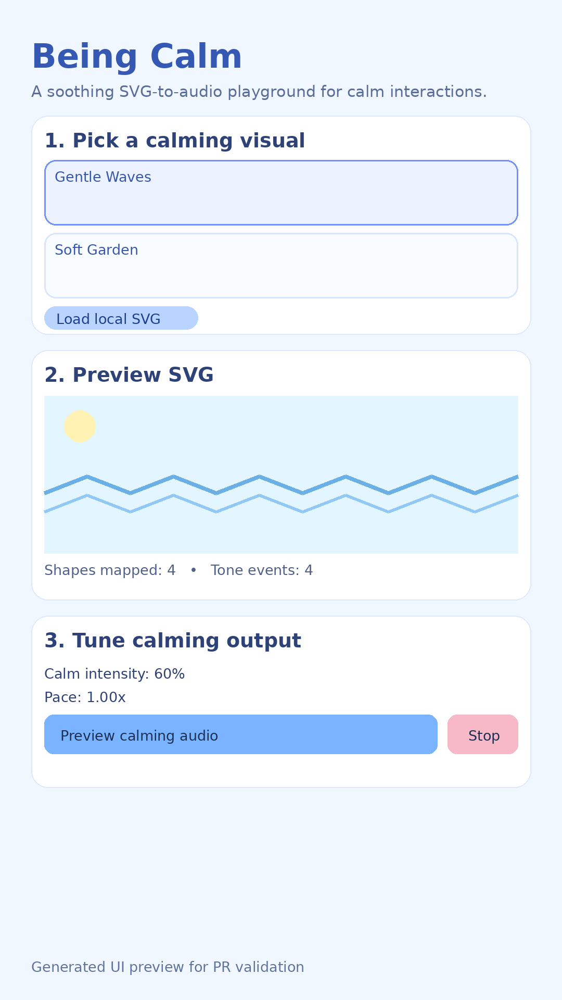

# Being Calm (React Native Android-first boilerplate)

Offline-first React Native boilerplate that maps SVG attributes to calming audio for children.



## What is included

- **Pure React Native CLI setup** (no Expo)
- **Android-capable native project** in `android/`
- **Offline SVG parsing** with `fast-xml-parser`
- **Offline audio generation** (WAV synthesis in JS + playback via `react-native-sound-player`)
- **Local SVG loading** from device files using `@react-native-documents/picker`
- **Predefined calming SVG assets** in `assets/calming-svgs/`
- **Child-friendly UI** in `App.tsx` with:
  - preset calming visuals
  - local SVG import
  - intensity/pace controls
  - audio preview/stop controls

## Project structure

- `App.tsx` – main child-friendly UI flow
- `assets/calming-svgs/` – bundled calming SVG files
- `src/services/svgParser.ts` – extracts shapes/colors/positions from SVG
- `src/services/audioMapper.ts` – maps SVG features into tone events
- `src/services/audioSynthesis.ts` – generates offline WAV and plays it
- `src/data/predefinedCalmingSvgs.ts` – preset metadata + SVG content

## Setup

> React Native `0.85.3` requires Node `>=22.11.0`.

```bash
npm install
```

## Run on Android

```bash
npm run android
```

## Useful scripts

```bash
npm run start
npm run lint
npm test
```

## GitHub Release APK flow

- Push a version tag like `v1.0.0`.
- GitHub Actions builds `android/app/build/outputs/apk/release/app-release.apk`.
- The APK is uploaded to that tag's GitHub Release assets.

## Notes for offline/private usage

- No SaaS services are required.
- The app logic works without internet access once installed.
- Audio is generated locally from SVG-derived tone events.

## Next steps (optional)

- Add more preset SVGs to `assets/calming-svgs/`
- Tune color/shape-to-tone mapping in `src/services/audioMapper.ts`
- Expand calming profiles (night mode, breathing cadence, etc.)
